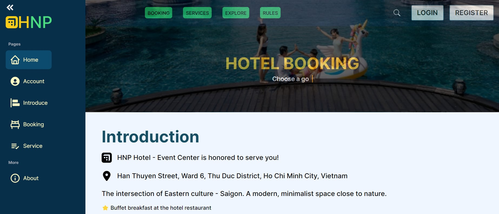
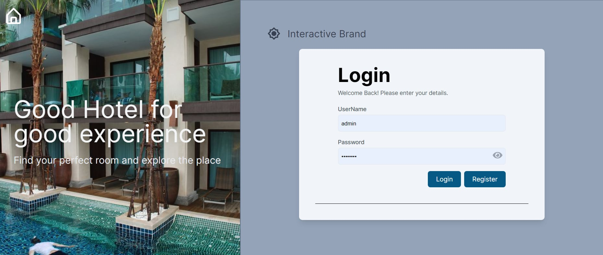

<h1>🌐 Hotel Booking Management</h1>
<p>This repository contains the frontend code for a hotel booking management system. The application is designed to provide a user-friendly interface for managing hotel room bookings, viewing available rooms, checking booking status, and more.</p>



This is a [Next.js](https://nextjs.org/) project bootstrapped with [`create-next-app`](https://github.com/vercel/next.js/tree/canary/packages/create-next-app).

## 📑 Table of Contents
- <a href="#demo">Demo</a>
- <a href="#features">Features</a>
- <a href="#tech-stack">Tech Stack</a>
- <a href="#getting-started">Getting Started</a>
- <a href="#learn-more">Learn More</a>
- <a href="#deploy-on-vercel">Deploy on Vercel</a>
- <a href="#contributing">Contributing</a>
- <a href="#license">License</a>

## Demo
<div>You can check out the live demo of the application <a href="http://192.168.28.41:5050">here</a>.</div>
<div>(Please make sure to use VPN UIT before accessing.)</div>




## Features

<table>
  <tbody>
    <tr>
      <td><strong>User Authentication:</strong> Secure login and registration system for users.</td>
    </tr>
    <tr>
      <td><strong>Room Management:</strong> View available rooms, room details, and prices.</td>
    </tr>
    <tr>
      <td><strong>Booking System:</strong> Book rooms, view booking history, and manage current bookings.</td>
    </tr>
    <tr>
      <td><strong>Admin Dashboard:</strong> Empowering administrators with tools to manage hotels, bookings, and user data efficiently.</td>
    </tr>
  </tbody>
</table>

## 💻Tech Stack
     

## Getting Started

Installation

```bash
# 1. Clone the repository:
git clone https://github.com/hienhayho/nmcnpm-frontend.git
# 2. Navigate to the project directory:
cd hotel-booking-management-frontend
# 3. Install dependencies:
npm i
# 4. Create a .env file:
```

Run the development server:

```bash
npm run dev
# or
yarn dev
# or
pnpm dev
# or
bun dev
```

Open [http://localhost:3000](http://localhost:3000) with your browser to see the result.

You can start editing the page by modifying `app/page.tsx`. The page auto-updates as you edit the file.

This project uses [`next/font`](https://nextjs.org/docs/basic-features/font-optimization) to automatically optimize and load Inter, a custom Google Font.

## Learn More

To learn more about Next.js, take a look at the following resources:

- [Next.js Documentation](https://nextjs.org/docs) - learn about Next.js features and API.
- [Learn Next.js](https://nextjs.org/learn) - an interactive Next.js tutorial.

You can check out [the Next.js GitHub repository](https://github.com/vercel/next.js/) - your feedback and contributions are welcome!

## Deploy on Vercel

The easiest way to deploy your Next.js app is to use the [Vercel Platform](https://vercel.com/new?utm_medium=default-template&filter=next.js&utm_source=create-next-app&utm_campaign=create-next-app-readme) from the creators of Next.js.

Check out our [Next.js deployment documentation](https://nextjs.org/docs/deployment) for more details.
